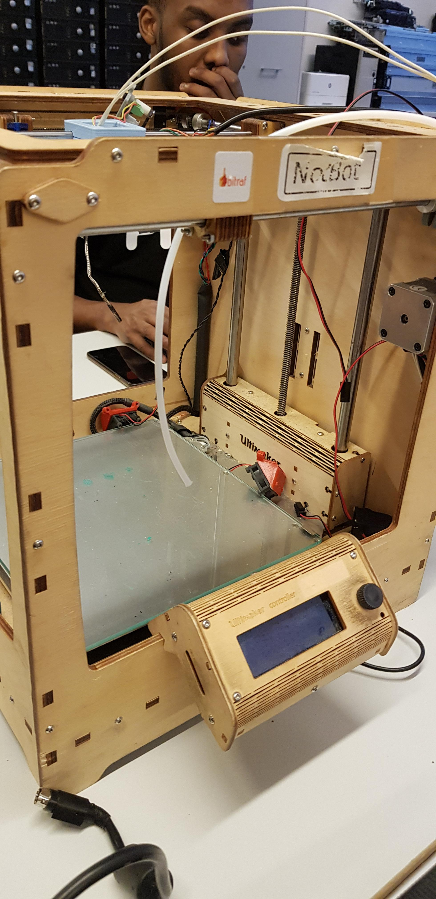
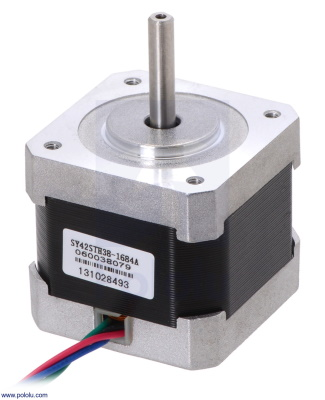
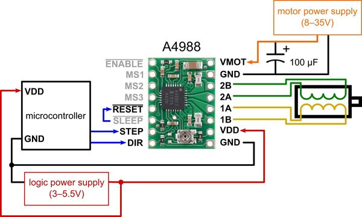
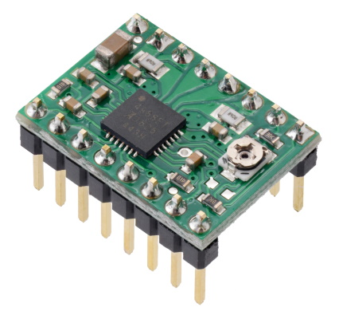
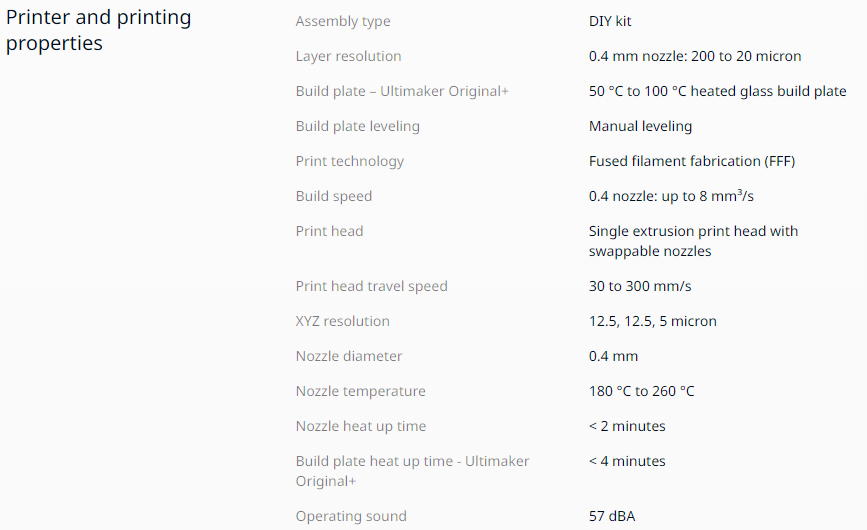

# Notbot 3D printer

## Deltaker
- Kristoffer Sandviken
- Ivar Andrei Bondad
- Lars Christian Helgesen
- Simen Solvang
- Dreni Suka
- ali abdullahi

## Status

## Specifikasjoner
- Fire Nema 17 step motorer

- Pololu stepper motor driver A4988

- Aktiv kjøling gjennom vifte på undersiden

## Mangende deler
- Print core
- Skruer for deler
## Ting som må fikses
- Print core mangles

- Trenger allen wrench med minste størrelse for å skru av og på deler

## Test
- Printeren har step motorer som beveger den rundt.

- Bruker en skrue for å bevege seg opp og ned.

- Tannhjulene og belte er stive/vanskelig å bevege
